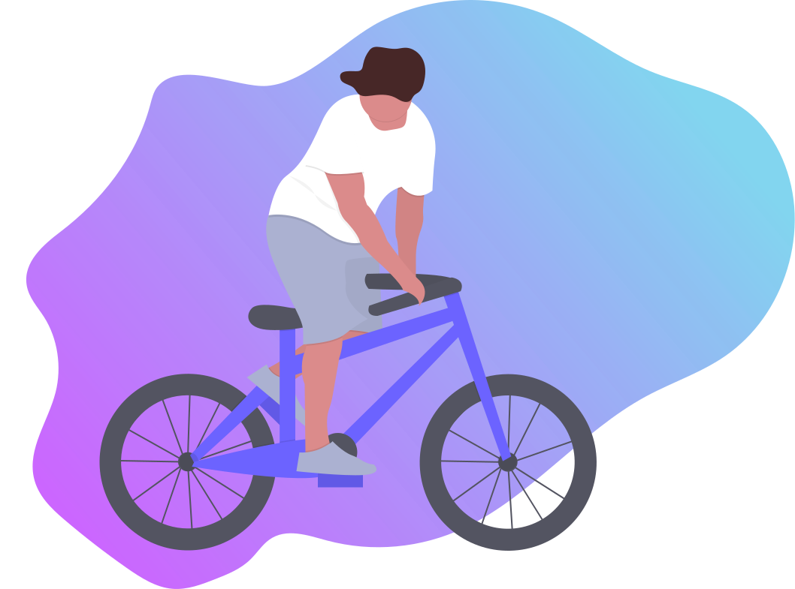

<div align="center">
	<br>
	<a href="https://raw.githubusercontent.com/pyadav/TIL/main/css/15042021_SVG_Animation_With_CSS.md">
		
	</a>
	<br>
</div>


SVGs are vector based so they scale across screen sizes and zoom levels.
SVG is 
- Scalable
- Less in file size
- Modifiable
##### Simplify the SVG code
For simplify and optimize the SVG code, we can use [SVGO](https://github.com/svg/svgo) 
which reduces the file size and saves the paths with unique IDs.

##### Create intentional groupings
If we want to animate a group of elements together then we can wrap
them in `<g></g>` tag also name them with a class or ID attribute.


### SVG Animation With CSS
- #### Using Transition property
  ```javascript 
  /*
    Limitation of the transition property is that it doesn’t give much
    control over what changes happen during the timeline
    */ 
  transition: property duration timing-function delay;
  ```
- #### Using Animation property
  ```javascript
  animation: name duration timing-function delay iteration-count direction fill-mode play-state;
  Keyframes
    Transforms - rotate, scale, translate
  ```

### SVG and React
There are two ways to use the SVG in react and
- Import the SVG as React component using [SVGR](https://react-svgr.com/)
  ```javascript
  import { ReactComponent as Logo } from "logo.svg"
  const LogoComponent = () => <Logo />
  ```
- Transform the SVG into JSX
  ```javascript
  const Circle = () => (
      <svg height="100" width="100">
        <circle cx="50" cy="50" r="40" stroke="#000" strockWidth="3" fill="red">
      </svg>
  )
  ```   
- #### Plugins
  - [Animate.CSS](https://animate.style/)
  - [GSAP](https://greensock.com/gsap/)
  - [Motion](https://www.framer.com/motion/)
